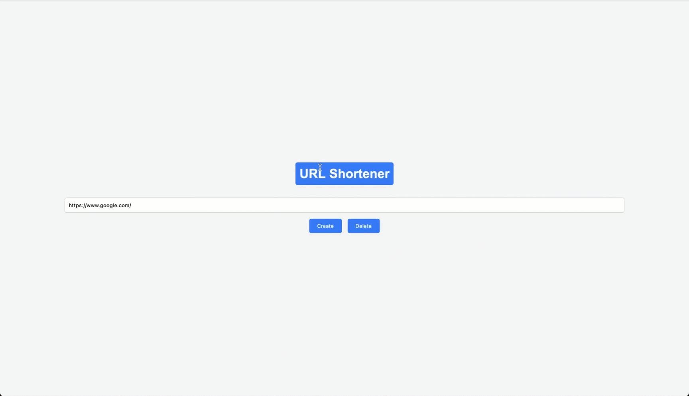

# URL Shortener

URL Shortener is a simple web application that allows you to shorten URLs and track their click counts. You can enter a URL, click "Create" to shorten it, and then click the shortened link to see how many times it has been clicked.

## Features

* Shorten long URLs into shorter, more manageable links.
* Track the number of clicks on each shortened URL.
* Edit the shortened URL if needed.
* Delete all shortened URLs with a single click.

## Usage

1. Enter the URL you want to shorten in the "Enter a URL" input field.
2. Click the "Create" button to generate a shortened URL.
3. Click the shortened URL to open it in a new tab.
4. The number of clicks on the shortened URL will be displayed next to it.
5. Click the "Edit" button to edit the shortened URL.
6. Click the "Save" button to save your changes.
7. Click the "Delete" button to remove all shortened URLs.

### Demo

## Installation

1. Clone or download the project repository.
2. Open the `index.html` file in your web browser.

## Technologies Used

* HTML
* CSS
* JavaScript